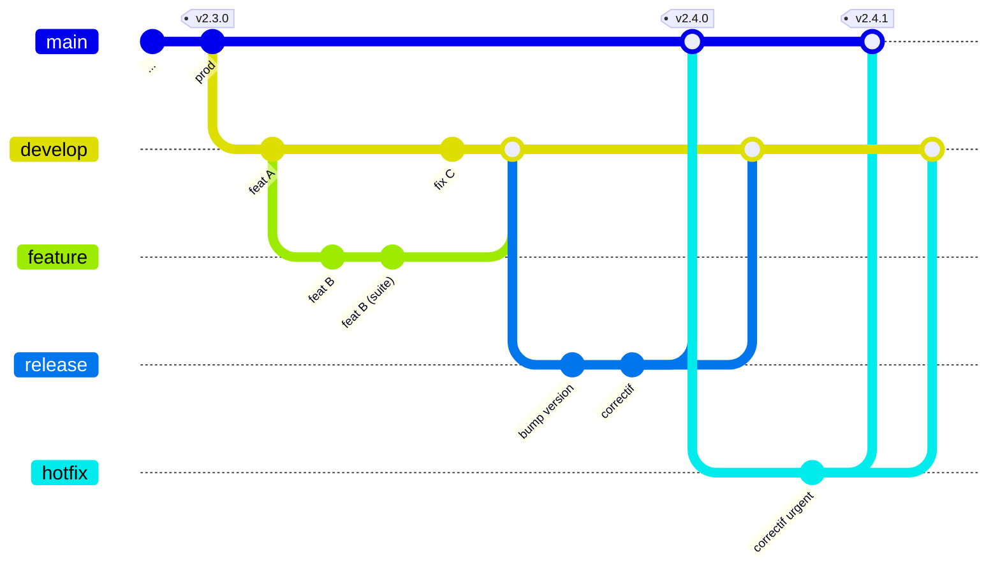

# GitFlow — mémo

Ce document est là pour que **personne ne soit bloqué par la terminologie**.
Si tu connais déjà GitFlow, tu peux passer directement au [README](README.md).

---

## 1. Le principe

Deux branches vivent **pour toujours** :

| Branche   | Contient                                          |
| --------- | ------------------------------------------------- |
| `main`    | ce qui est **en production**. Chaque MEP = un tag. |
| `develop` | ce qui est **prêt pour la prochaine version**.     |

Trois types de branches vivent **le temps d'un besoin** :

| Branche     | Part de   | Merge vers            | Sert à                                    |
| ----------- | --------- | --------------------- | ----------------------------------------- |
| `feature/*` | `develop` | `develop`             | développer un ticket du sprint            |
| `release/*` | `develop` | **`main` + `develop`** | stabiliser une version pendant la NR      |
| `hotfix/*`  | **`main`** | **`main` + `develop`** | corriger un incident déjà en production   |

> Les deux lignes en gras sont l'essentiel de GitFlow : une `release` et un `hotfix`
> se ferment **toujours des deux côtés**. Oublier le retour vers `develop`, c'est
> réintroduire le bug à la version suivante.

---

## 2. Le cycle complet

Exemple générique d'un projet fictif, sans rapport avec l'exercice :



*(les branches sont libellées `feature` / `release` / `hotfix` sur le schéma ; leurs vrais
noms suivent la convention du tableau ci-dessus)*

Le même cycle, en résumé — **les deux lignes marquées d'une flèche sont celles qu'on oublie** :

```
feature :  develop ──> feature/TICKET-123-slug ──> develop

release :  develop ──> release/X.Y.0 ──┬──> main      (+ tag vX.Y.0)
                                       └──> develop   <── à ne pas oublier

hotfix  :  main    ──> hotfix/X.Y.Z   ─┬──> main      (+ tag vX.Y.Z)
                                       └──> develop   <── à ne pas oublier
```

Oublier un merge retour vers `develop`, c'est livrer un correctif en production
puis le **perdre à la version suivante**.


---

## 3. Règles appliquées sur ce dépôt

1. **Aucun commit direct** sur `main` ni sur `develop`. Tout passe par une branche.
2. Intégration dans `develop` ou `main` avec un **merge commit** (`--no-ff` / *no fast-forward*),
   pour que la branche reste visible dans l'historique.
3. **Tags annotés** au format `vX.Y.Z`, posés **uniquement sur `main`**, à chaque MEP.
4. Nommage : `feature/TICKET-123-slug`, `release/X.Y.Z`, `hotfix/X.Y.Z`
   (la branche porte le numéro de la version qu'elle prépare).
5. Messages de commit en [Conventional Commits](https://www.conventionalcommits.org) :
   `feat(scope): ...`, `fix(scope): ...`, `chore(release): ...`, `docs: ...`.
6. Une branche terminée et mergée est **supprimée**.

---

## 4. Si tu travailles avec un client graphique

Tout est faisable à la souris. Les libellés à chercher :

| Besoin              | Gitoryx / SourceTree / Fork / GitKraken / VS Code / JetBrains |
| ------------------- | ---------------------------------------------------------- |
| Merge sans fast-forward | case **« Create a commit even if merge resolved via fast-forward »**, ou **No fast-forward** |
| Tag annoté          | *Create tag* → cocher/renseigner un **message** (sinon le tag est *lightweight*) |
| Rebase              | clic droit sur la branche cible → **Rebase current branch onto...** |
| Résoudre un conflit | onglet *Conflicts* / *Merge tool* / éditeur intégré         |

L'extension `git flow` (AVH) est autorisée si tu la connais. Dis-le simplement à voix haute.
